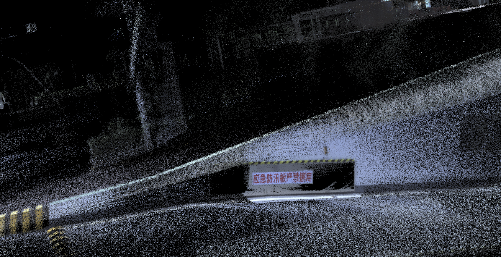

# This paper reproduces the SLAM research results from Mars lab of the University of Hong Kong -Fast Livo

[Video Tutorial](https://www.bilibili.com/video/BV1T142197ci/?share_source=copy_web&vd_source=dd0669827093367276172cd819a1ae99)

## What's new:
1. Adapted to  [Mid360 LiDAR](https://github.com/WilsonGuo/livox_ros_driver2)
2. Corrected the incorrect verification of virtual GPRMC instruction in STM32，
   See：[HardWare](https://github.com/WilsonGuo/FastLivo_Replication/tree/main/hardware)
 
   

See the wiki for more updates：https://github.com/WilsonGuo/FastLivo_Replication/wiki

    

# Principle of hardware synchronization：

    

# FAST-LIVO

## Fast and Tightly-coupled Sparse-Direct LiDAR-Inertial-Visual Odometry

**FAST-LIVO** is a fast LiDAR-Inertial-Visual odometry system, which builds on two tightly-coupled and direct odometry subsystems: a VIO subsystem and a LIO subsystem. The LIO subsystem registers raw points (instead of feature points on e.g., edges or planes) of a new scan to an incrementally-built point cloud map. The map points are additionally attached with image patches, which are then used in the VIO subsystem to align a new image by minimizing the direct photometric errors without extracting any visual features (e.g., ORB or FAST corner features).

    

